## AGENDA {.agenda-slide}
<!-- Klasse: .agenda-slide -->

1. Empirical, Evidence-Based Metascience
2. Context Characteristics
3. Testing the Role of Contextual Variation
4. Conclusion & Limitations

## {.section-slide}
<!-- Zwischentitelfolie 01 -->

::: {.section-number}
01
:::

::: {.section-bubble}
Empirical (i.e., Evidence-Based) Metascience
:::

## Empirical (i.e., Evidence-Based) Metascience
<!-- general symptom -> cause -> treatment -> effect/side-effect model -->

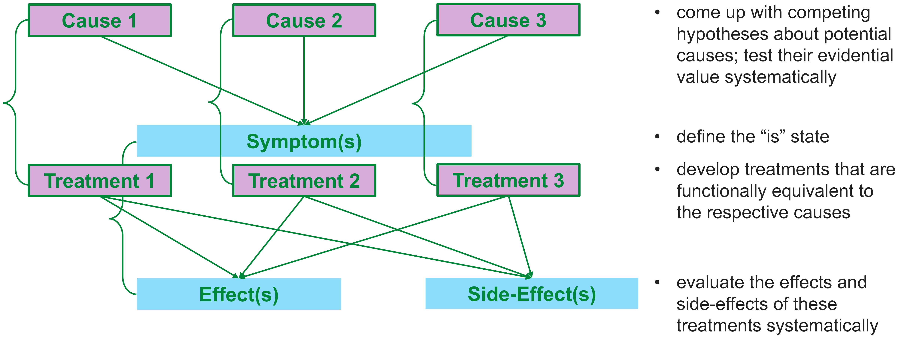{width=100%}

## Empirical (i.e., Evidence-Based) Metascience
<!-- applied to questionable research practices -->

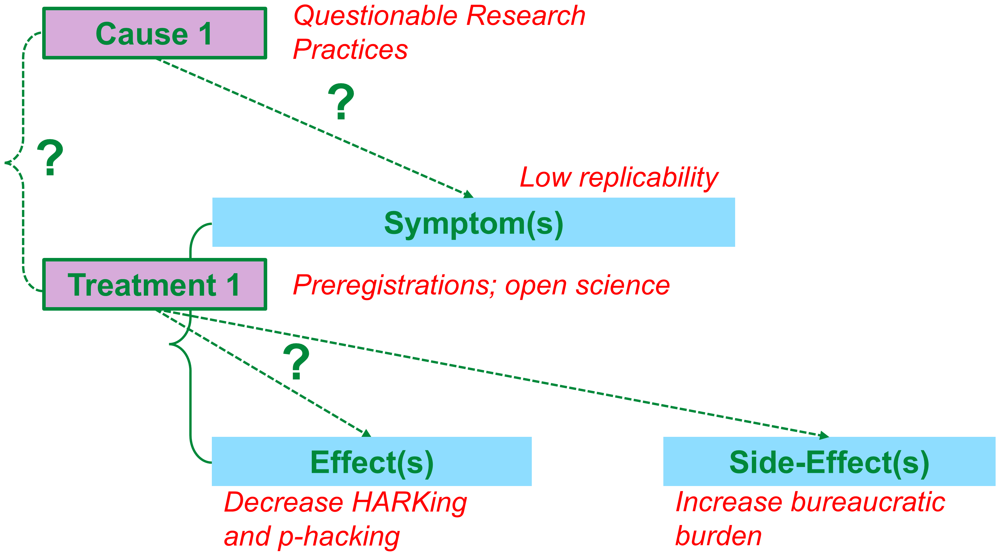{width=74%}

## Empirical (i.e., Evidence-Based) Metascience {.smaller}

::: {.lead}
Empirical metascience shows that…
:::

:::: {.columns}
::: {.column width="58%"}
::: {.incremental}
- questionable research practices can only explain a small part of non-replicability (e.g., Ulrich & Miller, 2020; Wegener, Pek, & Fabrigar, 2024)
- making ad-hoc changes to self-report scales (e.g., excluding items, changing wording, changing response format etc.) has only a small impact on the replicability of the focal finding (Böhm & Wetzel, forthcoming)
- many pre-registrations are of low quality (Hahn et al., in press) and deviations from the pre-registered analysis plan is the rule (rather than the exception; see Van den Akker et al., 2024)
- more and more datasets are now publicly accessible on repositories, but only a tiny fraction of data is actually re-usable (see Crüwell et al., 2023; Hardwicke et al., 2021), which explains why data are not really re-used (see Blask et al., 2021; Tenopir et al., 2020)
:::
:::

::: {.column width="42%"}
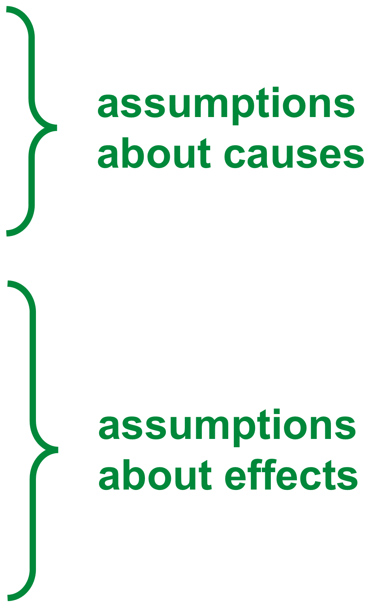{width=75%}

[Points 1–2 challenge assumptions about causes; points 3–4 challenge assumptions about effects.]{.text-small}
:::
::::

## Data Peeking and Replication Rate

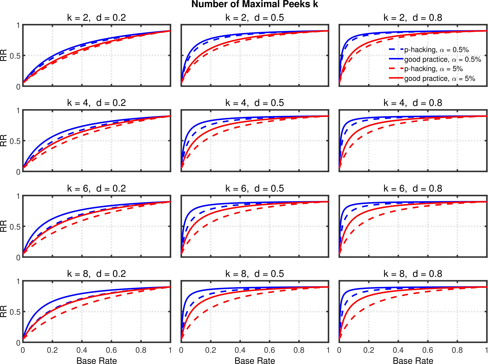{width=78%}

[*from Ulrich & Miller (2020):* influence of data peeking (i.e., checking whether a finding is significant after sampling 10 additional participants) on Replication Rate (RR; the relative frequency of obtaining a significant finding in a replication if the original finding had been significant at α = 5% / 0.5%) depending on the max. no. of data peeks (*k*), population effect size (*d*), and the base rate of H1 being true (π). Simulation result: the influence of data peeking on RR is negligible in comparison to π and *d*.]{.text-small}

## Empirical (i.e., Evidence-Based) Metascience
<!-- pivot: context dependency as a second, competing cause -->

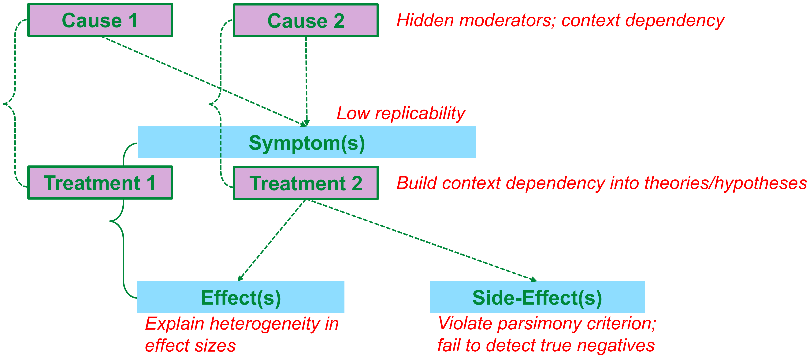{width=100%}

## {.section-slide}
<!-- Zwischentitelfolie 02 -->

::: {.section-number}
02
:::

::: {.section-bubble}
Context Characteristics
:::

## Context Characteristics: the ManyLabs 1 Example

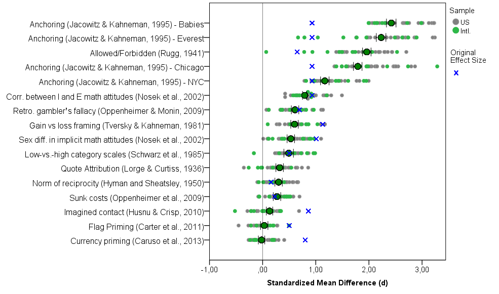{width=72%}

[*ManyLabs 1 Project (Klein et al., 2014)*]{.text-small}

## Context Characteristics {.smaller}

::: {.lead}
The “FACE” framework: which sample characteristics moderate replication of classic effects?
:::

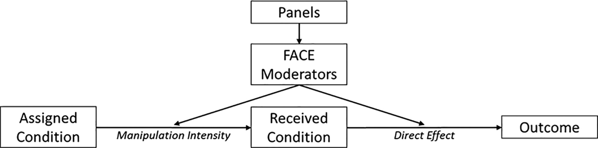{width=85%}

- **Panels:** 11 samples (e.g., ad-hoc student sample; MTurkers, Prolific workers, etc.)
- **FACE moderators:** Fluid Intelligence (e.g., numeracy), Attentiveness, Crystallized Intelligence (e.g., knowledge, life experience), Experience with online surveys
- **Effects tested:** four famous effects in econ/social psych — default (opt-out/in), framing, less-is-better, sunk costs

[*from Krefeld-Schwalb et al. (2024)*]{.text-small}

## Context Characteristics

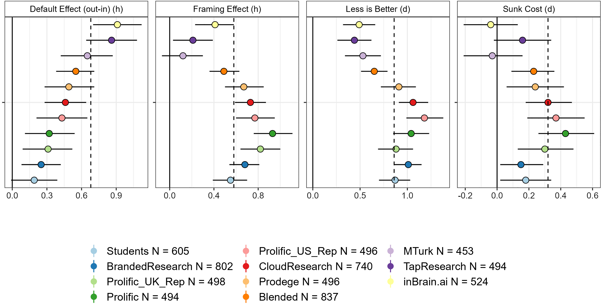{width=92%}

[*from Krefeld-Schwalb et al. (2024)*]{.text-small}

## Context Characteristics

:::: {.columns}
::: {.column width="50%"}
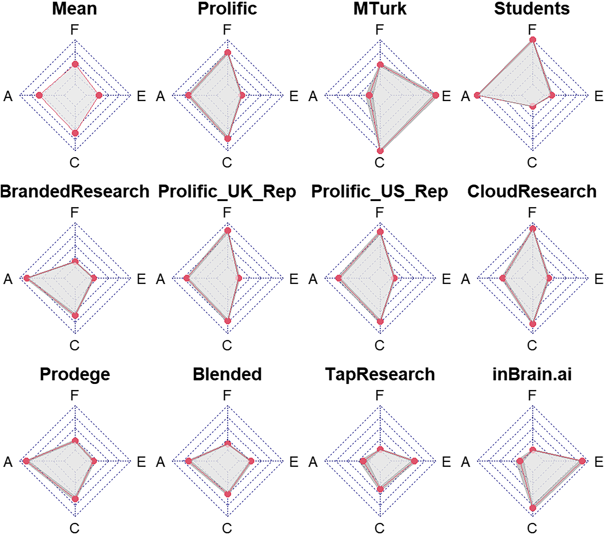{width=100%}
:::

::: {.column width="50%"}
Samples vary considerably with regard to the “FACE” parameters:

**MTurkers are …**

- Low in Attentiveness
- High in Crystallized Intelligence
- High in Experience

**Students are …**

- High in Attentiveness
- Low in Crystallized Intelligence
- Low in Experience

[*from Krefeld-Schwalb et al. (2024)*]{.text-small}
:::
::::

## Context Characteristics

:::: {.columns}
::: {.column width="55%"}
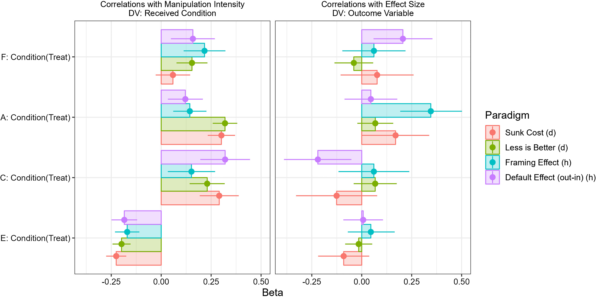{width=100%}
:::

::: {.column width="45%"}
Each radar axis indexes one FACE moderator:

- Indicators of Fluid Intelligence
- Indicators of Attentiveness
- Indicators of Crystallized Intelligence
- Indicators of Experience

[*from Krefeld-Schwalb et al. (2024)*]{.text-small}
:::
::::

## Conceptually Relevant vs. Irrelevant Context {.smaller}

:::: {.columns}
::: {.column width="58%"}
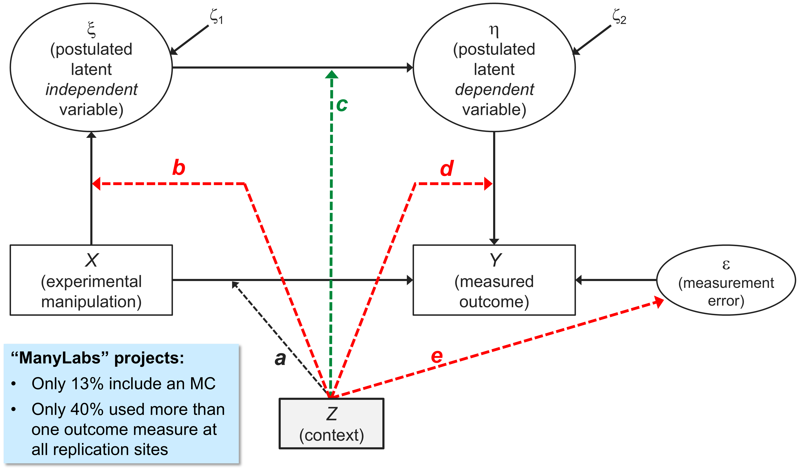{width=100%}
:::

::: {.column width="42%"}
- **a** → observed effect heterogeneity
- **b** → differences in construct validity of X between contexts
- **c** → conceptually relevant moderators associated w/context
- **d** → differences in construct validity of Y between contexts
- **e** → context-dependent (un)reliability

[*from Gollwitzer & Schwabe (2022)*]{.text-small}
:::
::::

## {.section-slide}
<!-- Zwischentitelfolie 03 -->

::: {.section-number}
03
:::

::: {.section-bubble}
Testing the Role of Contextual Variation
:::

## Testing the role of contextual variation {.smaller}

::: {.lead}
Examined the role of “conceptually relevant” and “conceptually irrelevant” contextual variables (Gollwitzer & Schwabe, 2022) by reanalyzing data from past multi-lab replications.
:::

- We searched the FORRT Replication Database (FReD) through 17.12.2025 and reviewed ongoing Psychological Science Accelerator (PSA) projects.
- 384 effect sizes were coded across 44 multi-site replication projects.
- We applied four inclusion criteria:
  1. To calculate **path *b***, a manipulation check should be used in the study.
  2. To estimate **path *d*** and ***e***, the outcome variable should be measured by a multi-item self-report scale (≥ 3 items), allowing differential item functioning (DIF) analysis and marginal reliability estimation.
  3. Item-level data must be publicly available.
  4. A comparison single-lab study (the original, or a pre-registered single-site replication) must be available as the reference group for DIF analysis.
- Only one effect, Shnabel & Nadler (2008), Study 4, fulfilled all of these criteria.

## Reanalysis of Shnabel & Nadler (2008), Study 4 data {.smaller}

> Victims are more likely to reconcile if they feel empowered, while perpetrators are more likely to do so if they feel accepted.

- We decomposed the interaction effect into two contrasts: effects for **victims** and effects for **perpetrators**.
- We used RP:P data as a reference, and ML5 (*k* = 8, all US samples) as test data.
- To estimate the heterogeneity of victims' and perpetrators' effects, we performed meta-regressions, where:
  - **b** = absolute differences of manipulation effectiveness (b1: role, b2: message)
  - **c** = protocol type (ML5 participants were randomly assigned to either the same vignette used in the original study and RP:P — the "original" protocol — or a "modified" vignette)
  - **d** = expected test score standardized differences (ETSSD; Meade & Wright, 2012)
  - **e** = absolute differences of marginal reliability (ρ)
- **ML5 finding:** the focal interaction effect was significant only among participants who were given the modified vignette (Baranski et al., 2020).

## Results: Victims effect {.smaller}

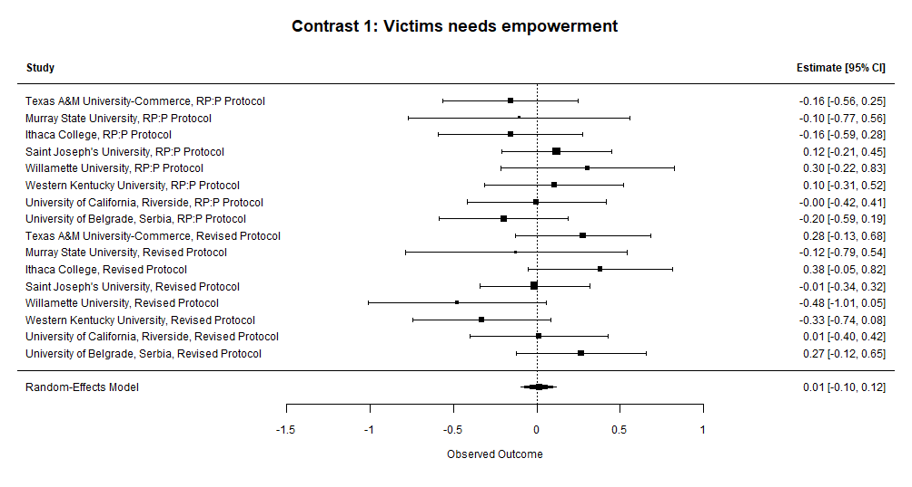{width=58%}

- Heterogeneity was low (τ² = 0.0025, I² = 5.15%).
- Conceptually-relevant (protocol types) and conceptually-irrelevant context (b, d, and e) failed to explain heterogeneity.
- **Regardless of any contextual variables, we failed to detect the victims effect.**

## Results: Perpetrators effect {.smaller}

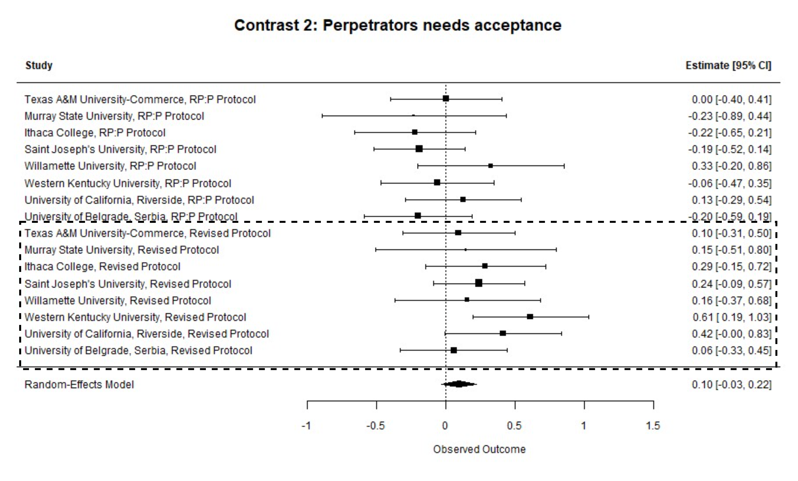{width=46%}

- Heterogeneity was moderate (τ² = 0.0162, I² = 25.67%).
- Only protocol type was significant and explained the entire heterogeneity in the model.
- ML5 samples using the “original” protocol yielded more heterogeneous ES, while ES from the “modified” protocol were consistently positive.
- **The perpetrator effect was small and positive only among participants given the modified protocol.**

## Conclusion & Limitations {.text-slide-bg}

::: {.lead}
What effect size heterogeneity in many-labs replications can — and cannot — tell us
:::

::: {.content-box}
- **Conceptually relevant** context characteristics (nature of the transgression; type of relationship between victim and transgressor) explain effect heterogeneity in the effects found by Shnabel and Nadler (2008) ― these might have to be built into the theory (“Needs-Based Model”).
- The example shows: **Context does matter!**
- Effect heterogeneity can be informative in many-labs replication studies ― especially if the effect to be replicated is (likely) a true positive (Fünderich, Beinhauer, & Renkewitz, 2025).
- Context can be modeled in **several different ways** (e.g., Pohl et al., in press; PsychMethods). Replication studies can be designed to test context effects (Hoffmann et al., 2025; AMPPS).
- Our approach shows how meta-regression can be used to analyze how much heterogeneity is due to **psychometric properties** (i.e., conceptually irrelevant context characteristics).
- BUT: We need more test cases to find out how much they really matter.
:::

## {.closing-slide .no-footer}

::: {.closing-left}
::: {.closing-contact-box}
**Dr. Rizqy Amelia Zein**
Center for Advanced Internet Studies (CAIS) & Universitas Airlangga\
amelia.zein@cais-research.de 

**Prof. Dr. Mario Gollwitzer**\
LMU München, Department of Psychology\
mario.gollwitzer@lmu.de · www.psy.lmu.de/soz
:::

::: {.closing-cais-logo}

:::
:::

::: {.closing-right}
::: {.closing-text}
Thank you!
:::

::: {.closing-bottom}
::: {.closing-org}
Center for Advanced Internet Studies (CAIS) gGmbH

Konrad-Zuse-Str. 2a, 44801 Bochum
:::

::: {.closing-contact-info}
[info@cais-research.de](mailto:info@cais-research.de)\
+49 234 9531 5000\
[www.cais-research.de](https://www.cais-research.de)
:::

::: {.closing-social}
<a href="https://www.linkedin.com/company/cais-nrw" title="LinkedIn"><i class="fa-brands fa-linkedin-in"></i></a>
<a href="https://x.com/cais_nrw" title="X (Twitter)"><i class="fa-brands fa-x-twitter"></i></a>
<a href="https://www.instagram.com/cais_nrw" title="Instagram"><i class="fa-brands fa-instagram"></i></a>
<a href="https://scholar.social/@cais" title="Mastodon"><i class="fa-brands fa-mastodon"></i></a>
<a href="https://www.facebook.com/caisnrw" title="Facebook"><i class="fa-brands fa-facebook-f"></i></a>
<a href="https://www.youtube.com/@cais_nrw" title="YouTube"><i class="fa-brands fa-youtube"></i></a>
:::
:::
:::

## Appendix – Descriptive Statistics

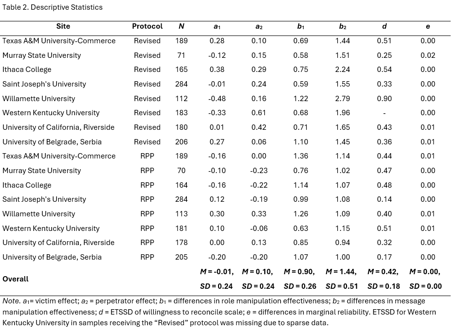{width=60%}

## Appendix – Model Parameters

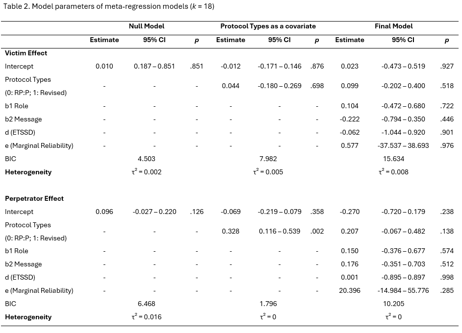{width=58%}
